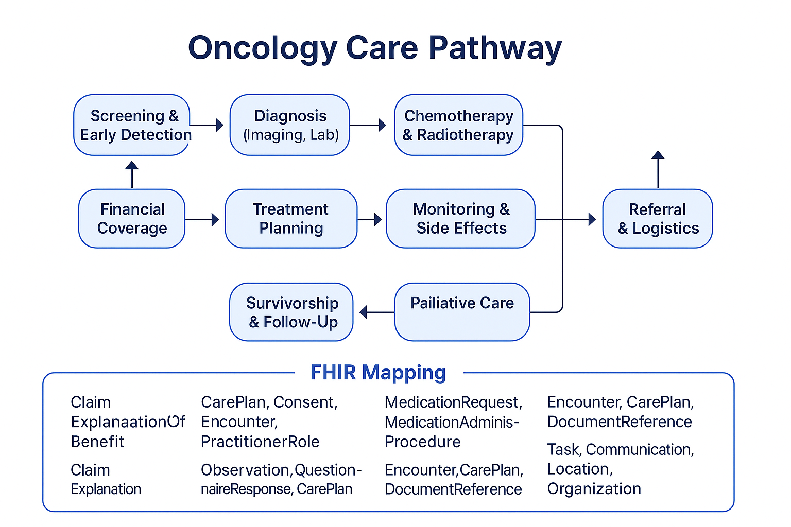

# Oncology Implementation Guide for Kenya (Oncology-IG-Kenya)

## Transforming Cancer Care Through FHIR-Based Digital Innovation

> "This Implementation Guide is a demonstration of how HL7® FHIR® can be leveraged to enhance the quality, continuity, and coordination of oncology care in Kenya. It is developed independently by a Kenyan health tech enthusiast, with a passion for improving cancer outcomes through open standards and interoperable digital solutions."

---

## Home

- **Version:** 0.1.0  
- **Status:** Draft as of 2025-06-16  
- **Canonical URL:** `http://example.org/ImplementationGuide/medby`  
- **Computable Name:** `oncologyfhirigkenya`  
- **Build Info:** Local CI using HL7® FHIR® Build Tools

---

## Purpose & Background

Kenya faces a growing cancer crisis. This FHIR Implementation Guide (IG) aims to model a comprehensive, standards-based oncology care pathway, grounded in local realities, to demonstrate how HL7® FHIR® can support cancer prevention, diagnosis, treatment, and survivorship across the continuum of care.

This is *not an official guide from the Ministry of Health or NHIF*, but rather a **proof-of-concept** created to stimulate innovation, collaboration, and alignment with national priorities.

---

## Kenya’s Cancer Burden: A Snapshot

According to [World Bank data (2020)](https://documents1.worldbank.org/curated/en/964571592290457869/pdf/Economic-and-Social-Consequences-of-Cancer-in-Kenya-Case-Studies-of-Selected-Households.pdf):

- 47,887 new cancer cases and 32,987 deaths were recorded in 2018.
- 80% of patients are diagnosed at advanced stages (Stage III or IV).
- Over 30% of affected households fall below the poverty line despite NHIF.
- Fewer than 30% of public facilities offer screening; only 7 provide radiotherapy.
- Only 36 oncologists serve a population of 50+ million.
- Patients often travel more than 100 km for diagnosis or treatment.

---

## Oncology Care Pathway (FHIR Mapping)

| Care Stage                     | FHIR Coverage |
|-------------------------------|---------------|
| Screening & Early Detection   | Patient, Observation, ServiceRequest, Encounter |
| Diagnosis (Imaging, Lab)      | Condition, Specimen, Procedure, DiagnosticReport, Observation |
| Treatment Planning            | CarePlan, Consent, Encounter, PractitionerRole |
| Chemotherapy & Radiotherapy   | MedicationRequest, MedicationAdministration, Procedure |
| Monitoring & Side Effects     | Observation, QuestionnaireResponse, CarePlan |
| Survivorship & Follow-Up      | Encounter, CarePlan, DocumentReference |
| Palliative Care               | MedicationRequest, Observation, RelatedPerson |
| Financial Coverage            | Claim, ExplanationOfBenefit, Coverage |
| Referral & Logistics          | Task, Communication, Location, Organization |

Each profile aligns with local workflows, national policy, and real constraints.

---

## Implementation Notes

Profiles support essential oncology tasks such as:

- Tracking cancer staging, histopathology, and tumor markers  
- Capturing chemotherapy regimens and adverse effects  
- Monitoring follow-up schedules and financial distress  
- Supporting referral coordination and treatment documentation

---

## Visual Overview

---

## Contact & Repository

- **Email:** medbyTech254@gmail.com  
- **GitHub:** [github.com/steve-macharia/Oncology-IG-Kenya](https://github.com/steve-macharia/Oncology-IG-Kenya)

---

This Implementation Guide is a personal initiative by a Kenyan digital health enthusiast. It reflects no official endorsement but aligns with national priorities to show what is possible when global standards meet local innovation.
